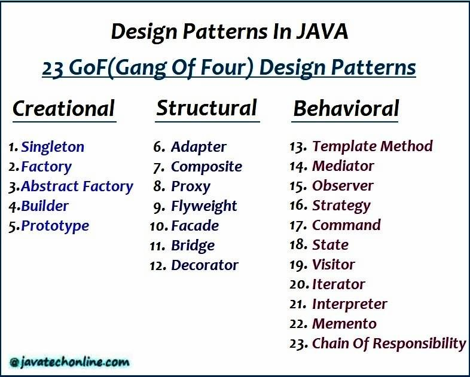

# Patrones de diseño con java
Ejemplos tomados de los siguientes enlaces
- [javatechonline](https://javatechonline.com/java-design-patterns-java)
- [refactoring.guru](https://refactoring.guru/es/design-patterns/java)
- [picodotdev](https://picodotdev.github.io/blog-bitix/2015/09/ejemplo-del-patron-de-diseno-builder/)
- [DigitalOcean](https://www.digitalocean.com/community/tutorials/java-singleton-design-pattern-best-practices-examples)


## Tipos de patrones de diseño
Los patrones de diseño más utilizados se clasifican en tres categorías principales
conformando un total de **23 patrones de diseño**

```
Patrones de diseño creacional
Patrones de diseño estructural
Patrones de diseño de comportamiento
```



## Patrones de diseño creacional
Veamos las siguientes tres definiciones:

- Los patrones de diseño creacional se ocupan de proporcional soluciones para
  instanciar un objeto de la mejor manera posible para situaciones específicas.


- Los patrones de creación proporcionan diversos mecanismos de creación de objetos, 
  que aumentan la flexibilidad y la reutilización del código existente de una manera 
  adecuada a la situación. Esto le da al programa más flexibilidad para decidir qué 
  objetos deben crearse para un caso de uso dado.


- Los patrones de diseño creacionales se centran en resolver problemas acerca de cómo 
  crear instancias de las clases de nuestra aplicación.

### Patrón de diseño singleton
Este patrón de diseño fue desarrollado en un proyecto aparte. Ir al 
[singleton-design-pattern en repositorio de GitHub](https://github.com/magadiflo/singleton-design-pattern)

No obstante, en este proyecto se tomó el ejemplo de Alexander Shvets, quien la define así: 

"Singleton es un patrón de diseño creacional que nos permite asegurarnos de que una clase tenga
una única instancia, a la vez que proporciona un punto de acceso global a dicha instancia."

### Patrón de diseño Factory
El patrón de diseño de fábrica se utiliza cuando tenemos una superclase con múltiples 
subclases y, según la entrada, necesitamos devolver una de las subclases. 
Este patrón elimina la responsabilidad de la creación de instancias de una clase de un 
programa cliente a la clase de fábrica. Además, podemos aplicar el patrón Singleton también 
en la clase Factory o hacer que el método factory sea estático.

La superclase en patrón de fábrica puede ser una interfaz, o una clase abstracta, 
o una clase Java normal.

### Patrón de diseño Abstract Factory
Casi similar a Factory Pattern, excepto por el hecho de que es más como una fábrica de fábricas.

El objetivo del patrón Abstract Factory es la creación de objetos agrupados en familias
sin tener que conocer las clases concretas destinadas a la creación de estos objetos.

### Patrón de diseño Builder
Separa la construcción de un objeto complejo de su representación, de forma que el mismo proceso
de construcción pueda crear diferentes representaciones.

El objetivo es abstraer la construcción de objetos complejos de su implementación, de modo que un cliente
pueda crear objetos complejos sin tener que preocuparse de las diferencias en su implementación.

Nos permite construir objetos complejos paso a paso. El patrón nos permite producir distintos tipos y 
representaciones de un objeto empleando el mismo código de construcción.
Al contrario que otros patrones creacionales, Builder no necesita  que los productos tengan una interfaz
común. Esto hace posible crear distintos productos utilizando el mismo proceso de construcción.

### Patrón de diseño Prototype
El patrón Prototype es uno de los patrones de diseño creacional, por lo que proporciona un mecanismo de 
creación de objetos. Sin embargo, el patrón Prototype se utiliza cuando la creación de objetos es un 
asunto costoso. Además, requiere mucho tiempo y recursos y si ya existe un objeto similar. 
Por lo tanto, este patrón proporciona un mecanismo para copiar el objeto original a un nuevo objeto y 
luego modificarlo de acuerdo con nuestras necesidades. Además, este patrón usa la clonación de 
Java para copiar el objeto.

Prototype es un patrón de diseño creacional que nos permite copiar objetos existentes sin que el código
dependa de sus clases.

## Patrones de diseño estructurales
Veamos las siguientes definiciones:

- Los patrones estructurales proporcionan diferentes formas de crear una estructura de clases,
  por ejemplo, utilizando la herencia y la composición para crear un objeto grande a partir de objetos pequeños.

- Los patrones estructurales se ocupan de cómo se combinan las clases y los objetos para formar estructuras
  más grandes.

- Tratan la manera en que los objetos se conectan con otros objetos, para asegurar que los cambios del sistema 
  no requieren cambiar esas conexiones.

- Facilitan soluciones y estándares eficientes con respecto a las composiciones de clase y las estructuras de 
  objetos. El concepto de herencia se utiliza para componer interfaces y definir formas de componer objetos 
  para obtener nuevas funcionalidades.

### Patrón de diseño Facade
Proporciona una interfaz simplificada para una biblioteca, un marco o cualquier otro conjunto complejo de clases.

En el patrón de fachada, las clases de fachada se utilizan para proporcionar una interfaz única para el conjunto 
de clases. La fachada simplifica la interacción de un cliente con un sistema complejo al localizar las interacciones 
en una sola interfaz. Como resultado, el cliente puede interactuar con un solo objeto en lugar de tener que 
interactuar directamente de manera complicada con los objetos que componen el subsistema.

### Patrón de diseño Proxy
Se utiliza para crear objetos que pueden representar funciones de otras clases u objetos y la interfaz se 
utiliza para acceder a estas funcionalidades

Proporciona un representante o sustituto de otro objeto para controlar el acceso a éste.

Proxy es un patrón de diseño estructural que te permite proporcionar un sustituto o marcador de posición para
otro objeto. Un proxy controla el acceso al objeto original, permitiéndote hacer algo antes o después de que
la solicitud llegue al objeto original.

Proxy es un patrón de diseño estructural que proporciona un objeto que actúa como sustituto de un objeto de 
servicio real utilizado por un cliente. Un proxy recibe solicitudes del cliente, realiza parte del trabajo 
(control de acceso, almacenamiento en caché, etc.) y después pasa la solicitud a un objeto de servicio.

El objeto proxy tiene la misma interfaz que un servicio, lo que lo hace intercambiable con un objeto real 
cuando se pasa a un cliente.

Proxy es muy valioso cuando tienes que añadir comportamientos a una clase cuyo código no puedes cambiar.

## Patrones de diseño de comportamiento
Veamos las siguientes definiciones:

- Los patrones de diseño de comportamiento ofrecen una solución para la mejor interacción entre objetos y 
  cómo proporcionar acoplamiento perdido y flexibilidad para extenderse fácilmente.

- Los patrones de comportamiento tratan con algoritmos y la asignación de responsabilidades entre objetos.

- Los patrones de comportamiento describen interacciones entre objetos y se centran en cómo los objetos se 
  comunican entre sí. Pueden reducir los diagramas de flujo complejos a simples interconexiones entre objetos 
  de varias clases.

### Patrón de diseño Strategy
Es un patrón de diseño de comportamiento que te permite definir una familia de algoritmos, colocar cada uno 
de ellos en una clase separada y hacer sus objetos intercambiables.

Tiene como objetivo adaptar el comportamiento y los algoritmos de un objeto en función de una necesidad
sin cambiar las interacciones de ese objeto con los clientes.

El patrón de diseño de estrategia es útil cuando hay un conjunto de algoritmos relacionados y un objeto 
cliente debe poder elegir dinámicamente un algoritmo de este conjunto que se adapte a sus necesidades actuales. 
El patrón de estrategia sugiere mantener la implementación de cada uno de los algoritmos en una clase separada. 
Cada uno de estos algoritmos encapsulados en una clase separada se conoce como Estrategia. 
Un objeto que utiliza un objeto Strategy a menudo se denomina objeto de contexto.